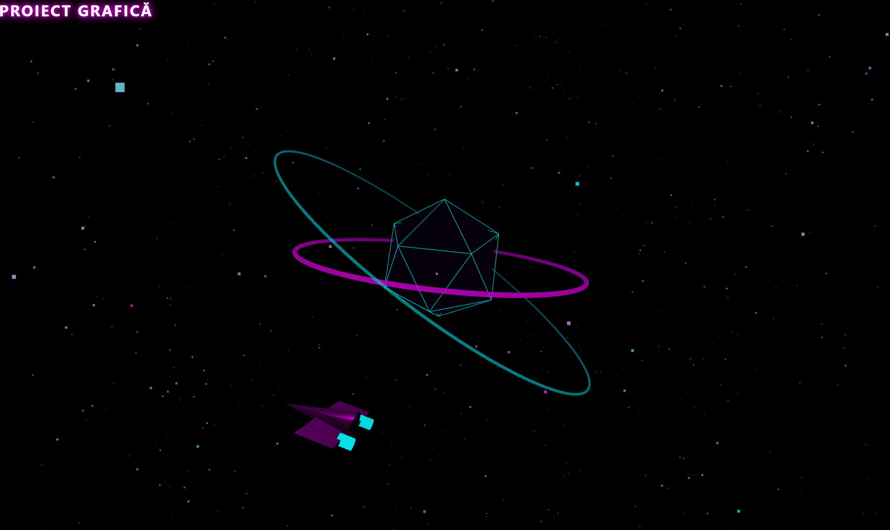

# Statie Spatiala

Acest proiect reprezintă o scenă 3D interactivă dezvoltată exclusiv cu biblioteca **Three.js** (WebGL). Scopul proiectului este de a crea o estetică hibridă care combină elemente de *Deep Space* cu vizualuri *Cyberpunk/Neon*, generând o stație spațială abstractă și colorată, patrulată de o navă spațială interactivă. Întregul mediu este complet procedural, generat geometric direct din cod, rulând fără necesitatea importării de modele `.obj` sau `.glb` externe.

## Tehnologii și Concepte Utilizate

* **HTML5 & CSS3:** Utilizate pentru interfața grafică suprapusă (HUD) cu efecte de `text-shadow` specifice tematicii neon.
* **Three.js (ES6 Modules):** Importat via CDN pentru a construi și randa sistemul 3D.
* **OrbitControls:** Modul pentru interacțiunea utilizatorului cu scena (panoramare, zoom, rotire la 360 de grade).

## Elemente Tehnice Implementate

1. **Geometrie Compusă (Nucleul):** Stația centrală folosește un `IcosahedronGeometry` cu un material metalic puternic. Peste acesta am suprapus un `EdgesGeometry` care desenează un contur wireframe luminos cian, accentuând direcția retro-futuristă.
2. **Nava de Patrulare (Interceptor):** Un vehicul spațial asamblat modular din geometrii primitive (`ConeGeometry` pentru fuzelaj, `BoxGeometry` pentru aripi și `CylinderGeometry` pentru propulsoarele care emit lumină cian).
3. **Cinematică / Animație Avansată:** Nava orbitează în jurul stației pe o traiectorie matematică (utilizând `Math.sin` și `Math.cos`). Sistemul folosește funcția `lookAt()` spre un punct viitor calculat pentru a menține botul navei pe vectorul de deplasare, plus o rotație locală pe axa Z pentru a simula efectul fizic de înclinare (banking) în curbe.
4. **Sistem de Particule (Nebuloasă):** `BufferGeometry` cu 2000 de vertiși. Culorile sunt interpolate la nivel de vertex (`vertexColors: true`) între magenta și cian pentru a crea o textură cosmică vibrantă.
5. **Iluminare:** Două surse de lumină de tip `PointLight` puternice, complementare cromatic (Roz și Albastru/Cian) care reflectă fotorealist pe geometria metalică.

## Cum se rulează

Aplicația este de tip "Zero Dependencies". Pentru vizualizare:
1. Se descarcă și se deschide fișierul `index.html`.
2. Datorită randării complet procedurale (fără modele externe), fișierul ocolește politicile CORS și rulează direct pe orice mașină, folosind exclusiv browserul web.

## Prezentare

